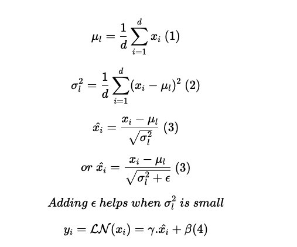

# Candle Tutorial - Convert Pytorch Models to Candle

[Candle](https://github.com/huggingface/candle) is an ML framework written in rust that takes advantage of the speed and memory safety Rust provides for writing machine workloads. It can be used as a drop in replacement for ML frameworks like PyTorch, it also has [python bindings](https://github.com/huggingface/candle/tree/main/candle-pyo3) so you can use it from python...

This repo provides some guide for converting pytorch models from the transformers library to Candle by directly translating the pytorch code to Candle ...

❗️❗️: To make the code easily understandable, I have annotated each line of the Rust/Candle code with the equivalent PyTorch code.
Tutorial Structure:
- [Getting Started](#getting-started)
    - [0. Important things to note](#0-important-things-to-note)
    - [1. Start a new rust project](#1-start-a-new-rust-project)
    - [2. Install Candle & Other Packages](#2-install-candle--other-packages)

- [Parallels between Pytorch and Candle](#3-parallels-between-pytorch-and-candle)
    - [Tensors](#tensors)
    - [Tensor Operations](#tensor-operations)
- [Translating a PyTorch Transformer Model into Candle](#3-translating-a-pytorch-transformer-model-into-candle)
    - [RoBERTa](#31-roberta)
        - [a. Writing Building Blocks](#a-writing-building-blocks)
        - [b. Roberta Config](#b-roberta-config)
        - [c. RobertaEmbeddings](#c-robertaembeddings)
        - [d. RobertaSelfAttention](#d-robertaselfattention)
        - [e. RobertaSelfOutput](#e-robertaselfoutput)
        - [f. RobertaIntermediate](#f-robertaintermediate)
        - [g. RobertaOutput](#g-robertaoutput)
        - [h. RobertaLayer](#h-robertalayer)
        - [i. RobertaEncoder](#i-robertaencoder)
        - [j. RobertaModel](#j-robertamodel)
- [Debugging/Testing the model](#debugging-the-model)

## Getting Started:

### 0. Important things to note

- When Porting an already trained checkpoint to Candle, there's a bunch of PyTorch code that are not relevant and they are mostly included for handling different scenarios in training. It's definitely beneficial to know which functions to bypass if the conversion effort is mostly geared towards loading an already trained model.

- Python Built in Method: Unlike Python where we have built-in methods like `__call__` that allow us to use a class as a method and `__init__` for initializing a class, In rust we have to explicitly define methods like `Class::new()` to initialize a class and `Class::forward()` to perform a forward pass. This is going to be a recurrent theme in most of the code shown below.

- It is important to write [unit tests](tests/test_roberta.rs) after writing most or every module to ensure that input and output shapes in Candle are consistent with the same module in pytorch.

- In PyTorch, we can initialize module weights by creating a class method `_init_weights` but in candle it becomes a design decision, you can initialize a tensor using the shape of your weights/bias (e.g. ) and hold it in a `VarBuilder` which then used to initialize the tensors in each module.


### 1. Start a new rust project
The command below will create a new rust project called `candle-roberta` in the current directory with a `Cargo.toml` file and a `src` directory with a `main.rs` file in it.

```bash
$ cargo new candle-roberta
```


### 2. Install Candle & Other Packages

You can follow the instructions [here](https://huggingface.github.io/candle/guide/installation.html) to install candle or you can use the command below to install candle directly from github.

For this tutorial, we would be using the `candle-core` and `candle-nn` crates.
`candle-core` provides the core functionality of the candle framework. It provides an implementation the basic blocks for building neural networks and also integrations with different backends like Cuda, MKL, CPU etc, while `candle-nn` provides a high level API for building neural networks.

```bash
- cargo add --git https://github.com/huggingface/candle.git candle-core  # install candle-core
- cargo add --git https://github.com/huggingface/candle.git candle-nn # install candle-nn
```

Other frameworks we would need for this tutorial are:
- `anyhow` for error handling ==> `cargo add anyhow`
- `serde` for serialization ==> `cargo add serde`
- `serde_json` for json serialization ==> `cargo add serde_json`
- `hf-hub` for integrating with the huggingface hub ==> `cargo add hf-hub`
- `tokenizers` for tokenizing text ==> `cargo add tokenizers`

## 3. Parallels between Pytorch and Candle

To convert a pytorch model to candle, it is important understand the parallels between the two frameworks.
- Candle is a rust framework, so it is statically typed, while pytorch is a python framework, so it is dynamically typed. This means that you need to be explicit about the types of your variables in candle, while in pytorch, you don't need to be explicit about the types of your variables.

### Tensors

The examples shows below can be found [here]();

- Initializing a Tensor: Tensors can be directly created from an array in both frameworks

    - Pytorch: in pytorch the data type is automatically inffereed from the data;

        ```python
        import torch
        from typing import List
        
        data: List = [1, 2, 3]
        tensor = torch.tensor(data)

        nested_data = [[1, 2, 3], [4, 5, 6], [7, 8, 9]]
        nested_tensor = torch.tensor(nested_data)
        ```
    - Candle: in candle, the data type needs to be explicitly specified;

        ```rust
        use candle_core::{DType, Device, Tensor};
        use anyhow::Result;

        let data: [u32; 3] = [1u32, 2, 3];
        let tensor = Tensor::new(&data, &Device::Cpu)?;
        println!("tensor: {:?}", tensor.to_vec1::<u32>()?);

        let nested_data: [[u32; 3]; 3] = [[1u32, 2, 3], [4, 5, 6], [7, 8, 9]];
        let nested_tensor = Tensor::new(&nested_data, &Device::Cpu)?;
        println!("nested_tensor: {:?}", nested_tensor.to_vec2::<u32>()?);
        ```

- Creating a tensor from another tensor
    
    - Pytorch: in pytorch, the data type is automatically inferred from the data;

        ```python
        zero_tensor = torch.ones_like(tensor)
        random_tensor = torch.rand_like(tensor)
        ```

    - Candle: in candle, the data type needs to be explicitly specified;

        ```rust
        let data: [u32; 3] = [1u32, 2, 3];
        let tensor = Tensor::new(&data, &Device::Cpu)?;

        let zero_tensor = tensor.zeros_like()?;
        println!("zero_tensor: {:?}", zero_tensor.to_vec1::<u32>()?);

        let ones_tensor = tensor.ones_like()?;
        println!("ones_tensor: {:?}", ones_tensor.to_vec1::<u32>()?);

        let random_tensor = tensor.rand_like(0.0, 1.0)?;
        println!("random_tensor: {:?}", random_tensor.to_vec1::<f64>()?);
        ```

- Checking tensor dimensions:
    - PyTorch
        ```python
        print(tensor.shape)
        print(tensor.size())
        ```
    - Candle
        ```rust
        // 1 dimensional tensor
        println!("tensor shape: {:?}", tensor.shape().dims()); 
        // 2 dimensional tensor
        println!("tensor shape: {:?}", tensor.shape().dims2()); 
        // 3 dimensional tensor
        println!("tensor shape: {:?}", tensor.shape().dims3()); 
        ```

###  Tensor Operations: 

    Performing tensor operations is pretty similar across both frameworks
    Some examples can be found here:: [Candle CheatSheet](https://github.com/huggingface/candle/blob/main/README.md#how-to-use)


## 3. Translating a PyTorch Transformer Model into Candle

Here's the fun part! In this section we are going to take a look at translating models from the transformers library to candle. We would be using the [RoBERTa](https://huggingface.co/transformers/model_doc/roberta.html) and [XLM-Roberta](https://huggingface.co/docs/transformers/model_doc/xlm-roberta) model for this tutorial.

We would be translating the [Pytorch Source Code](https://github.com/huggingface/transformers/blob/main/src/transformers/models/roberta/modeling_roberta.py) into Candle Code and then load the pretrained checkpoint into Rust and compare the output from  both frameworks.

Note ❗️❗️: To make the code easily understandable, I have annotated each line of the Rust/Candle code with the equivalent PyTorch code.

### 3.1. RoBERTa

RoBERTa is a variant of the BERT model. Although both models have different pretraining approaches, structurally both models are very similar and the major difference between both models is that in the RoBERTa layer, Position numbers begin at padding_idx+1,  While in BERT, Position numbers begin at 0.

Following the transformers PyTorch implementation,  RoBERTa Model can be divided into the 2 main parts (embeddings and encoder):

```
RobertaModel(
  (embeddings): RobertaEmbeddings(
    (word_embeddings): Embedding(50265, 768, padding_idx=1)
    (position_embeddings): Embedding(514, 768, padding_idx=1)
    (token_type_embeddings): Embedding(1, 768)
    (LayerNorm): LayerNorm((768,), eps=1e-05, elementwise_affine=True)
    (dropout): Dropout(p=0.1, inplace=False)
  )
  (encoder): RobertaEncoder(
    (layer): ModuleList(
      (0-11): 12 x RobertaLayer(
        (attention): RobertaAttention(
          (self): RobertaSelfAttention(
            (query): Linear(in_features=768, out_features=768, bias=True)
            (key): Linear(in_features=768, out_features=768, bias=True)
            (value): Linear(in_features=768, out_features=768, bias=True)
            (dropout): Dropout(p=0.1, inplace=False)
          )
          (output): RobertaSelfOutput(
            (dense): Linear(in_features=768, out_features=768, bias=True)
            (LayerNorm): LayerNorm((768,), eps=1e-05, elementwise_affine=True)
            (dropout): Dropout(p=0.1, inplace=False)
          )
        )
        (intermediate): RobertaIntermediate(
          (dense): Linear(in_features=768, out_features=3072, bias=True)
          (intermediate_act_fn): GELUActivation()
        )
        (output): RobertaOutput(
          (dense): Linear(in_features=3072, out_features=768, bias=True)
          (LayerNorm): LayerNorm((768,), eps=1e-05, elementwise_affine=True)
          (dropout): Dropout(p=0.1, inplace=False)
        )
      )
    )
  )
)
```

- <strong>Roberta Config</strong>: For Holding Model Configuration
- <strong>Roberta Model (RobertaModel)</strong> : This is the main model class that contains the embedding and the encoder module.
    - Embedding  (RobertaEmbeddings)
    - Encoder (RobertaEncoder)

- <strong>Embedding (RobertaEmbeddings)</strong>: The Embedding module is a combination of the following:
    - Word Embedding   --> PyTorch Linear Module
    - Position Embedding   --> PyTorch Linear Module
    - Token Type Embedding   --> PyTorch Linear Module
    - Layer Norm 

- <strong>Encoder  (RobertaEncoder)</strong>: The Encoder is just made up a number of Attention Layers stacked on one another:
    - x number of RobertaLayers: This is a a PyTorch ModuleList of RobertaLayer

- <strong>Roberta Layer (RobertaLayer)</strong>: The RobertaLayer is made up of the following modules:
    - <strong>Attention Block (RobertaAttention)</strong> -> PyTorch Module (made up of Self Attention Layer and Self Attention Output Layer)
        - <strong>Self Attention Layer (RobertaSelfAttention)</strong>
        - <strong>Self Attention Output Layer (RobertaSelfOutput)</strong>

    - <strong>Intermediate Layer (RobertaIntermediate)</strong> --> PyTorch Linear Module
    - <strong>Output Layer (RobertaOutput)</strong> --> PyTorch Linear Module

Listed above are the main components of the model. Other building blocks for implementing the model include:

- <strong>Layer Norm</strong> --> PyTorch LayerNorm Module
- <strong>Dropout</strong> --> PyTorch Dropout Module
- <strong>Activation</strong> --> PyTorch Activation Function


### Translating Pytorch Modules into Candle

#### Import necessary Modules:

Import the necessary modules from candle and other crates:

- DType: This is an enum that represents the data type of a tensor.
- Device: This is an enum that represents the device a tensor is stored on.
- Result: This is a type alias for `std::result::Result<T, anyhow::Error>` for error handling
- Tensor: This is a struct that represents a tensor.

- Embedding: This is a prebuilt struct that represents an embedding layer similar to `nn.Embedding`.
- Module: This is a trait that represents a neural network module similar to `nn.Module` in PyTorch.
- Varbuilder: Module builder for creating variables similar to `nn.Parameter` in PyTorch.

    
    ```rust
    use candle_core::{DType, Device, Result, Tensor}; 
    use candle_nn::{Embedding, Module, VarBuilder};
    use serde::Deserialize;
    ```

### a. Writing Building Blocks:

- Linear/Embeddin: This is a helper function for loading the weights of a linear/embedding layer using `VarBuilder` from a checkpoint file. We create these 2 helper functions because we will use them multiple times:

    ```rust
    fn embedding(vocab_size: usize, hidden_size: usize, vb: VarBuilder) -> Result<Embedding> {
        let embeddings = vb.get((vocab_size, hidden_size), "weight")?;
        Ok(Embedding::new(embeddings, hidden_size))
    }

    fn linear(size1: usize, size2: usize, vb: VarBuilder) -> Result<Linear> {
        let weight = vb.get((size2, size1), "weight")?;
        let bias = vb.get(size2, "bias")?;
        Ok(Linear::new(weight, Some(bias)))
    }
    ```

- Layer Norm (https://pytorch.org/docs/stable/generated/torch.nn.LayerNorm.html): Used to a normalize a tensor over a given axis. It is used in the embedding layer and the encoder layer. A good explanation of layer normalization can be [found here](https://www.pinecone.io/learn/batch-layer-normalization/#What-is-Layer-Normalization). This is required because we need to implement the low-level layer norm module in Candle.

    
    *Layer Normalization from https://www.pinecone.io/learn/batch-layer-normalization/#What-is-Layer-Normalization*


    - PyTorch: In PyTorch, we can use LayerNorm by calling it as a module

        ```python
        from torch import nn

        LayerNorm = nn.LayerNorm(config.hidden_size, eps=config.layer_norm_eps)
        ```

    - Candle: In candle we can implement the layer normalization using the equation above. Steps:
        - Since normalization is done over the last axis which is the hidden size, we can use the `sum_keepdim` method to sum over the last axis and divide by dimension size to get `mean_x`.
        - For each element in the tensor, we subtract the mean and square the result and divide by hidden dimension to get `norm_x`.
        - To get the normalized input, we subtract the mean from the input and divide by the square root of `norm_x + eps`.
        - To get the final output, we multiply the normalized input by the weight of the normalization layer and add the bias.

        ```rust
        pub struct LayerNorm {
            weight: Tensor, // Weight vector of the LayerNorm Layer
            bias: Tensor, // Bias vector of the LayerNorm Layer
            eps: f64, // Epsilon value for numerical stability
        }

        impl LayerNorm {
            // Constructor for LayerNorm 
            pub fn new(weight: Tensor, bias: Tensor, eps: f64) -> Self {
                Self { weight, bias, eps }
            }

            pub fn forward(&self, x: &Tensor) -> Result<Tensor> {
                let x_dtype = x.dtype(); // Get the data type of the input tensor
                let internal_dtype = match x_dtype {
                    DType::F16 | DType::BF16 => DType::F32,
                    d => d,
                };
                let (_bsize, _seq_len, hidden_size) = x.dims3()?; // Get the dimensions of the input tensor
                let x = x.to_dtype(internal_dtype)?; 
                let mean_x = (x.sum_keepdim(2)? / hidden_size as f64)?; // Get the mean of the input tensor and divide by the hidden size
                let x = x.broadcast_sub(&mean_x)?; // Subtract the mean from the input tensor
                let norm_x = (x.sqr()?.sum_keepdim(2)? / hidden_size as f64)?; // Get the squared norm of the input tensor and divide by the hidden size
                let x_normed = x.broadcast_div(&(norm_x + self.eps)?.sqrt()?)?; // Get the normalized input
                let x = x_normed
                    .to_dtype(x_dtype)?
                    .broadcast_mul(&self.weight)?
                    .broadcast_add(&self.bias)?;
                Ok(x)
            }
        }
        ```

        This struct can be used as follows:

        ```rust
        let w_gen = Tensor::new(&[[3f32, 1.]], &Device::Cpu)?;
        let b_gen = Tensor::new(-2f32, &Device::Cpu)?;

        // initialize a layer norm layer
        let layer_norm = LayerNorm::new(w_gen, b_gen, 1f64);

        let data: [u32; 3] = [1u32, 2, 3];
        let input_tensor = Tensor::new(&data, &Device::Cpu)?;
        let normalized_tensor = layer_norm.forward(&input_tensor)?;
        ```

- Dropout: Randomly zero out different parts of the input tensor using a probability value. This is only used during training, since we are translating a pretrained model, we can just write a struct that returns the passed input tensor

   - PyTorch: In PyTorch, we can use LayerNorm by calling it as a module

        ```python
        from torch import nn

        dropout = nn.Dropout(p=0.1)
        input = torch.randn(2)
        output = dropout(input)
        ```
    - Candle: In candle we can implement the dropout layer by just returning the input tensor

        ```rust
        struct Dropout {
            #[allow(dead_code)]
            pr: f64,
        }

        impl Dropout {
            fn new(pr: f64) -> Self {
                Self { pr }
            }

            fn forward(&self, x: &Tensor) -> Result<Tensor> {
                Ok(x.clone())
            }
        }
        ```

        This struct can be used as follows:

        ```rust
        let dropout = Dropout::new(0.1);

        let data: [u32; 3] = [1u32, 2, 3];
        let input_tensor = Tensor::new(&data, &Device::Cpu)?;
        let dropout_tensor = dropout.forward(&input_tensor)?;
        ```

- Activation: The RoBERTa uses a GELU activation function. We can implement the GELU using a similar approach as dropout above with no input params. Candle tensors have an inbuilt module to perform this operation

    - PyTorch: In PyTorch, we can use LayerNorm by calling it as a module

        ```python
        from torch import nn

        activation = nn.GELU()
        input = torch.randn(2)
        output = activation(input)
        ```

    - Candle: In candle we can implement the dropout layer by just returning the input tensor

        ```rust
        struct Activation {}

        impl Activation {
            fn new() -> Self {
                Self {}
            }

            fn forward(&self, x: &Tensor) -> Result<Tensor> {
                Ok(x.gelu()?)
            }
        }
        ```

        This struct can be used as follows:

        ```rust
        let activation = Activation::new();

        let data: [u32; 3] = [1u32, 2, 3];
        let input_tensor = Tensor::new(&data, &Device::Cpu)?;
        let activation_tensor = activation.forward(&input_tensor)?;
        ```


### b. Roberta Config:

Up next is the Roberta Config. This is a struct that holds the configuration of the model. It is similar to the [RobertaConfig](https://github.com/huggingface/transformers/blob/e1cec43415e72c9853288d4e9325b734d36dd617/src/transformers/models/roberta/configuration_roberta.py#L37) in the transformers library. For this Struct, We will initialize the default values for the config (We implement the `Default` trait for the `RobertaConfig` struct ) and then use the serde crate to deserialize the config from a json file. Alternatively we can create a `RobertaConfig::new()` method for creating a new instance of RobertaConfig

```rust
pub struct RobertaConfig {
    vocab_size: usize,
    hidden_size: usize,
    num_hidden_layers: usize,
    num_attention_heads: usize,
    intermediate_size: usize,
    hidden_act: String,
    hidden_dropout_prob: f64,
    max_position_embeddings: usize,
    type_vocab_size: usize,
    initializer_range: f64,
    layer_norm_eps: f64,
    pad_token_id: usize,
    bos_token_id: usize,
    eos_token_id: usize,
    position_embedding_type: String,
    use_cache: bool,
    classifier_dropout: Option<f64>,
    model_type: Option<String>,
}

impl Default for RobertaConfig {
    fn default() -> Self {
        Self {
            vocab_size: 50265,
            hidden_size: 768,
            num_hidden_layers: 12,
            num_attention_heads: 12,
            intermediate_size: 3072,
            hidden_act: "gelu".to_string(),
            hidden_dropout_prob: 0.1,
            max_position_embeddings: 512,
            type_vocab_size: 2,
            initializer_range: 0.02,
            layer_norm_eps: 1e-12,
            pad_token_id: 1,
            bos_token_id: 0,
            eos_token_id: 2,
            position_embedding_type: PositionEmbeddingType::Absolute,
            use_cache: true,
            classifier_dropout: None,
            model_type: Some("roberta".to_string()),
        }
    }
}
```

### c. RobertaEmbeddings:
[HuggingFace PyTorch Implementation](https://github.com/huggingface/transformers/blob/e1cec43415e72c9853288d4e9325b734d36dd617/src/transformers/models/roberta/modeling_roberta.py#L65)

In the `__init__` function of the embedding class, we have 3 linear layers for processing word_embeddings, position_embeddings and token_type_ids. Similar to the PyTorch implementation, there are two important class methods that we need to implement.

- [create_position_ids_from_input_embeds](https://github.com/huggingface/transformers/blob/46092f763d26eb938a937c2a9cc69ce1cb6c44c2/src/transformers/models/roberta/modeling_roberta.py#L136): A function to generate position ids from embeddings. I have included the pytorch equivalent of each line as a comment.

    ```rust
    pub fn create_position_ids_from_input_embeds(&self, input_embeds: &Tensor) -> Result<Tensor> {
        // input_shape = inputs_embeds.size()
        // In candle, we use dims3() for getting the size of a 3 dimensional tensor
        let input_shape = input_embeds.dims3()?;
        // sequence_length = input_shape[1]
        let seq_length = input_shape.1;

        // position_ids = torch.arange( self.padding_idx + 1, sequence_length + self.padding_idx + 1, \
        // dtype=torch.long, device=inputs_embeds.device)
        let mut position_ids = Tensor::arange(
            self.padding_idx + 1,
            seq_length as u32 + self.padding_idx + 1,
            &Device::Cpu,
        )?;

        // return position_ids.unsqueeze(0).expand(input_shape)
        position_ids = position_ids
            .unsqueeze(0)?
            .expand((input_shape.0, input_shape.1))?;
        Ok(position_ids)
    }
    ```
- [create_position_ids_from_input_ids](https://github.com/huggingface/transformers/blob/46092f763d26eb938a937c2a9cc69ce1cb6c44c2/src/transformers/models/roberta/modeling_roberta.py#L1558): A function to generate position_ids from input_ids. 

    ```rust
    pub fn create_position_ids_from_input_ids(input_ids: &Tensor, padding_idx: u32, past_key_values_length: u8) -> Result<Tensor> {
        // mask = input_ids.ne(padding_idx).int()
        let mask = input_ids.ne(padding_idx)?; 
        // incremental_indices = (torch.cumsum(mask, dim=1).type_as(mask) + past_key_values_length) * mask
        let incremental_indices = cumsum_2d(&mask, 0, input_ids.device())?; 

        // incremental_indices.long() + padding_idx
        let incremental_indices = incremental_indices.broadcast_add(&Tensor::new(&[past_key_values_length], input_ids.device())?)?; 

        Ok(incremental_indices)
    }
    ```

- [Embedding Layer] : The embedding layer is made up of 3 linear layers for processing word_embeddings, position_embeddings and token_type_ids. The output of the embedding layer is the sum of the word_embeddings, position_embeddings and token_type_embeddings. The output is then passed through a layer norm and dropout layer. A link to the pytorch implementation is shown above.

    ```rust
    pub struct RobertaEmbeddings {
        word_embeddings: Embedding,
        position_embeddings: Option<Embedding>,
        token_type_embeddings: Embedding,
        layer_norm: LayerNorm,
        dropout: Dropout,
        pub padding_idx: u32,
    }

    impl RobertaEmbeddings {
        pub fn load(vb: VarBuilder, config: &RobertaConfig) -> Result<Self> {

            // nn.Embedding(config.vocab_size, config.hidden_size)
            let word_embeddings = embedding(
                config.vocab_size,
                config.hidden_size,
                vb.pp("word_embeddings"),
            )?;

            // nn.Embedding(config.max_position_embeddings, config.hidden_size)
            let position_embeddings = embedding(
                config.max_position_embeddings,
                config.hidden_size,
                vb.pp("position_embeddings"),
            )?;

            // nn.Embedding(config.type_vocab_size, config.hidden_size)
            let token_type_embeddings = embedding(
                config.type_vocab_size,
                config.hidden_size,
                vb.pp("token_type_embeddings"),
            )?;

            // nn.LayerNorm(config.hidden_size, eps=config.layer_norm_eps)
            let layer_norm = layer_norm(
                config.hidden_size,
                config.layer_norm_eps,
                vb.pp("LayerNorm"),
            )?;

            // nn.Dropout(config.hidden_dropout_prob)
            let dropout = Dropout::new(config.hidden_dropout_prob);
            
            let padding_idx = config.pad_token_id as u32;

            Ok(Self {
                word_embeddings,
                position_embeddings: Some(position_embeddings),
                token_type_embeddings,
                layer_norm,
                dropout,
                padding_idx,
            })
        }

        pub fn forward(&self, input_ids: &Tensor, token_type_ids: &Tensor, position_ids: Option<&Tensor>, inputs_embeds: Option<&Tensor>) -> Result<Tensor> {

            let position_ids = match position_ids {
                Some(ids) => ids.to_owned(),
                None => {
                    if Option::is_some(&inputs_embeds){
                        // self.create_position_ids_from_inputs_embeds(inputs_embeds)
                        let position_ids = self.create_position_ids_from_input_embeds(inputs_embeds.unwrap())?; //
                        position_ids
                    } else {
                        // create_position_ids_from_input_ids(input_ids, self.padding_idx, past_key_values_length)
                        let position_ids = create_position_ids_from_input_ids(input_ids, self.padding_idx, 1)?; 
                        position_ids
                    } 
                }
            };


            let inputs_embeds : Tensor = match inputs_embeds {
                Some(embeds) => embeds.to_owned(),
                None => {
                    // self.word_embeddings(input_ids)
                    let embeds = self.word_embeddings.forward(input_ids)?; 
                    embeds
                }
            };

            // self.token_type_embeddings(token_type_ids)
            let token_type_embeddings = self.token_type_embeddings.forward(token_type_ids)?; 
            // inputs_embeds + token_type_embeddings
            let mut embeddings = (inputs_embeds + token_type_embeddings)?; 

            if let Some(position_embeddings) = &self.position_embeddings {
                // embeddings + self.position_embeddings(position_ids)
                embeddings = embeddings.broadcast_add(&position_embeddings.forward(&position_ids)?)? 
            }

            // self.LayerNorm(embeddings)
            let embeddings = self.layer_norm.forward(&embeddings)?; 
            // self.dropout(embeddings)
            let embeddings = self.dropout.forward(&embeddings)?; 

            Ok(embeddings)
            
        }
    }
    ```

### d. RobertaSelfAttention:
[HuggingFace PyTorch Implementation](https://github.com/huggingface/transformers/blob/e1cec43415e72c9853288d4e9325b734d36dd617/src/transformers/models/roberta/modeling_roberta.py#L155). The self attention layer is made up of 3 linear layers for processing the query, key and value. The output of the self attention layer is the dot product of the query and key. The output is then passed through a softmax layer and a dropout layer which is then multiplied by the value.

```rust

```rust
struct RobertaSelfAttention {
    query: Linear,
    key: Linear,
    value: Linear,
    dropout: Dropout,
    num_attention_heads: usize,
    attention_head_size: usize,
}

impl RobertaSelfAttention {
    fn load(vb: VarBuilder, config: &RobertaConfig) -> Result<Self> {
        // config.hidden_size / config.num_attention_heads
        let attention_head_size = config.hidden_size / config.num_attention_heads;
        // self.num_attention_heads * self.attention_head_size
        let all_head_size = config.num_attention_heads * attention_head_size; 
        // nn.Dropout(config.attention_probs_dropout_prob)
        let dropout = Dropout::new(config.hidden_dropout_prob); 
        let hidden_size = config.hidden_size;

        // nn.Linear(config.hidden_size, self.all_head_size)
        let query = linear(hidden_size, all_head_size, vb.pp("query"))?; 
        // nn.Linear(config.hidden_size, self.all_head_size)
        let value = linear(hidden_size, all_head_size, vb.pp("value"))?; 
        // nn.Linear(config.hidden_size, self.all_head_size)
        let key = linear(hidden_size, all_head_size, vb.pp("key"))?; 
        Ok(Self {
            query,
            key,
            value,
            dropout,
            num_attention_heads: config.num_attention_heads,
            attention_head_size,
        })
    }

    fn transpose_for_scores(&self, xs: &Tensor) -> Result<Tensor> {
        
        // x.size()[:-1] + (self.num_attention_heads, self.attention_head_size)
        let mut new_x_shape = xs.dims().to_vec();
        new_x_shape.pop();
        new_x_shape.push(self.num_attention_heads);
        new_x_shape.push(self.attention_head_size);

        //  x = x.view(new_x_shape) || x.permute(0, 2, 1, 3)
        let xs = xs.reshape(new_x_shape.as_slice())?.transpose(1, 2)?;
        xs.contiguous()
    }

    fn forward(&self, hidden_states: &Tensor) -> Result<Tensor> {
        // self.query(hidden_states)
        let query_layer = self.query.forward(hidden_states)?;
        // self.key(hidden_states) 
        let key_layer = self.key.forward(hidden_states)?; 
        // self.value(hidden_states)
        let value_layer = self.value.forward(hidden_states)?; 

        // self.transpose_for_scores(query_layer)
        let query_layer = self.transpose_for_scores(&query_layer)?;
        // self.transpose_for_scores(key_layer) 
        let key_layer = self.transpose_for_scores(&key_layer)?;
        // self.transpose_for_scores(value_layer)
        let value_layer = self.transpose_for_scores(&value_layer)?; 

        // attention_scores = torch.matmul(query_layer, key_layer.transpose(-1, -2))
        let attention_scores = query_layer.matmul(&key_layer.t()?)?;
        // attention_scores / math.sqrt(self.attention_head_size)
        let attention_scores = (attention_scores / (self.attention_head_size as f64).sqrt())?; 
        // attention_probs = nn.functional.softmax(attention_scores, dim=-1)
        let attention_probs = {candle_nn::ops::softmax(&attention_scores, candle_core::D::Minus1)?}; 
        // attention_probs = self.dropout(attention_probs)
        let attention_probs = self.dropout.forward(&attention_probs)?; 

        // torch.matmul(attention_probs, value_layer)
        let context_layer = attention_probs.matmul(&value_layer)?;
        // context_layer = context_layer.permute(0, 2, 1, 3).contiguous()
        let context_layer = context_layer.transpose(1, 2)?.contiguous()?; 

        // new_context_layer_shape = context_layer.size()[:-2] + (self.all_head_size,)
        // context_layer = context_layer.view(new_context_layer_shape)
        let context_layer = context_layer.flatten_from(candle_core::D::Minus2)?; // 
        Ok(context_layer)
    }
}
```

### e. RobertaSelfOutput:
[HuggingFace PyTorch Implementation](https://github.com/huggingface/transformers/blob/e1cec43415e72c9853288d4e9325b734d36dd617/src/transformers/models/roberta/modeling_roberta.py#L290). The output of the Self Attention Layer is passed through the Self Output layer which is made up of a linear layer, layer norm and dropout layer.

```rust
struct RobertaSelfOutput {
    dense: Linear,
    layer_norm: LayerNorm,
    dropout: Dropout,
}

impl RobertaSelfOutput {
    fn load(vb: VarBuilder, config: &RobertaConfig) -> Result<Self> {
        // nn.Linear(config.hidden_size, config.hidden_size)
        let dense = linear(config.hidden_size, config.hidden_size, vb.pp("dense"))?; 
        //  nn.LayerNorm(config.hidden_size, eps=config.layer_norm_eps)
        let layer_norm = layer_norm(
            config.hidden_size,
            config.layer_norm_eps,
            vb.pp("LayerNorm"),
        )?;

        // nn.Dropout(config.hidden_dropout_prob)
        let dropout = Dropout::new(config.hidden_dropout_prob); 
        Ok(Self {
            dense,
            layer_norm,
            dropout,
        })
    }

    fn forward(&self, hidden_states: &Tensor, input_tensor: &Tensor) -> Result<Tensor> {
        // self.dense(hidden_states)
        let hidden_states = self.dense.forward(hidden_states)?;
        // self.dropout(hidden_states)
        let hidden_states = self.dropout.forward(&hidden_states)?;
        // self.LayerNorm(hidden_states + input_tensor)
        self.layer_norm.forward(&(hidden_states + input_tensor)?) 
    }
}
```

### f. RobertaAttention:
[HuggingFace PyTorch Implementation](https://github.com/huggingface/transformers/blob/e1cec43415e72c9853288d4e9325b734d36dd617/src/transformers/models/roberta/modeling_roberta.py#L305). The Roberta Attention Layer is made up of the Self Attention Layer and the Self Output Layer implemented earlier. The output of the Self Attention Layer is passed through the Self Output Layer.

```rust
struct RobertaAttention {
    self_attention: RobertaSelfAttention, 
    self_output: RobertaSelfOutput,
}

impl RobertaAttention {
    fn load(vb: VarBuilder, config: &RobertaConfig) -> Result<Self> {
        // RobertaSelfAttention(config, position_embedding_type=position_embedding_type)
        let self_attention = RobertaSelfAttention::load(vb.pp("self"), config)?;
        // RobertaSelfOutput(config) 
        let self_output = RobertaSelfOutput::load(vb.pp("output"), config)?; 

        Ok(Self {
            self_attention,
            self_output,
        })
    }

    fn forward(&self, hidden_states: &Tensor) -> Result<Tensor> {
        //self_outputs = self.self(hidden_states)
        let self_outputs = self.self_attention.forward(hidden_states)?; 
        // attention_output = self.output(self_outputs[0], hidden_states)
        let attention_output = self.self_output.forward(&self_outputs, hidden_states)?; 

        Ok(attention_output)
    }
}
```

### g. RobertaIntermediate
[HuggingFace PyTorch Implementation](https://github.com/huggingface/transformers/blob/e1cec43415e72c9853288d4e9325b734d36dd617/src/transformers/models/roberta/modeling_roberta.py#L355). The intermediate layer is made up of a linear layer and an activation function. Here we use the GELU activation function. This layer combined with the Attention Layer and an Output layer makes up the Encoder.

```rust
struct RobertaIntermediate {
    dense: Linear,
    intermediate_act: HiddenActLayer,
}

impl RobertaIntermediate {
    fn load(vb: VarBuilder, config: &RobertaConfig) -> Result<Self> {
        // nn.Linear(config.hidden_size, config.intermediate_size)
        let dense = linear(config.hidden_size, config.intermediate_size, vb.pp("dense"))?; 
        Ok(Self {
            dense,
            intermediate_act: Activation::new(),
        })
    }

    fn forward(&self, hidden_states: &Tensor) -> Result<Tensor> {
        // self.dense(hidden_states)
        let hidden_states = self.dense.forward(hidden_states)?; 
        // self.intermediate_act_fn(hidden_states)
        let ys = self.intermediate_act.forward(&hidden_states)?; 
        Ok(ys)
    }
}
```

### h. RobertaOutput
[HuggingFace PyTorch Implementation](https://github.com/huggingface/transformers/blob/e1cec43415e72c9853288d4e9325b734d36dd617/src/transformers/models/roberta/modeling_roberta.py#L371). The output layer is made up of a linear layer, layer norm and dropout layer. This layer combined with the Attention Layer and an Intermediate layer makes up the Encoder.

```rust
struct RobertaOutput {
    dense: Linear,
    layer_norm: LayerNorm,
    dropout: Dropout,
}

impl RobertaOutput {
    fn load(vb: VarBuilder, config: &RobertaConfig) -> Result<Self> {
        // nn.Linear(config.intermediate_size, config.hidden_size)
        let dense = linear(config.intermediate_size, config.hidden_size, vb.pp("dense"))?;
        // nn.LayerNorm(config.hidden_size, eps=config.layer_norm_eps)
        let layer_norm = layer_norm(
            config.hidden_size,
            config.layer_norm_eps,
            vb.pp("LayerNorm"),
        )?; 
        let dropout = Dropout::new(config.hidden_dropout_prob);
        Ok(Self {
            dense,
            layer_norm,
            dropout,
        })
    }

    fn forward(&self, hidden_states: &Tensor, input_tensor: &Tensor) -> Result<Tensor> {
        // self.dense(hidden_states)
        let hidden_states = self.dense.forward(hidden_states)?;
        // self.dropout(hidden_states)
        let hidden_states = self.dropout.forward(&hidden_states)?;
        // self.LayerNorm(hidden_states + input_tensor)
        self.layer_norm.forward(&(hidden_states + input_tensor)?) 
    }
}
```

### i. RobertaLayer
[HuggingFace PyTorch Implementation](https://github.com/huggingface/transformers/blob/e1cec43415e72c9853288d4e9325b734d36dd617/src/transformers/models/roberta/modeling_roberta.py#L386): This does not include an implementation of cross-attention as in the Pytorch code. As mentioned in the previous layers, The Robertalayer is made up of an Attention Layer, an Intermediate Layer and an Output Layer. This layer combined with the Attention Layer and an Output layer makes up the Encoder.

```rust
struct RobertaLayer {
    attention: RobertaAttention,
    intermediate: RobertaIntermediate,
    output: RobertaOutput,
}

impl RobertaLayer {
    fn load(vb: VarBuilder, config: &RobertaConfig) -> Result<Self> {
        // RobertaAttention(config)
        let attention = RobertaAttention::load(vb.pp("attention"), config)?;
        // RobertaIntermediate(config)
        let intermediate = RobertaIntermediate::load(vb.pp("intermediate"), config)?; 
        // RobertaOutput(config)
        let output = RobertaOutput::load(vb.pp("output"), config)?; 
        Ok(Self {
            attention,
            intermediate,
            output,
        })
    }

    fn forward(&self, hidden_states: &Tensor) -> Result<Tensor> {
        // self.attention(hidden_states)
        let attention_output = self.attention.forward(hidden_states)?; 

        //  self.intermediate(attention_output)
        let intermediate_output = self.intermediate.forward(&attention_output)?; 
        // self.output(intermediate_output, attention_output)
        let layer_output = self
            .output
            .forward(&intermediate_output, &attention_output)?; 
        Ok(layer_output)
    }
}
```

### j. RobertaEncoder
[HuggingFace PyTorch Implementation](https://github.com/huggingface/transformers/blob/e1cec43415e72c9853288d4e9325b734d36dd617/src/transformers/models/roberta/modeling_roberta.py#L473). The Encoder is made up of a stack of RobertaLayers. The output of the Encoder is the output of the last RobertaLayer.

```rust
impl RobertaEncoder {
    fn load(vb: VarBuilder, config: &RobertaConfig) -> Result<Self> {
        // nn.ModuleList([RobertaLayer(config) for _ in range(config.num_hidden_layers)])
        let layers = (0..config.num_hidden_layers)
            .map(|index| RobertaLayer::load(vb.pp(&format!("layer.{index}")), config))
            .collect::<Result<Vec<_>>>()?; 
        Ok(RobertaEncoder { layers })
    }

    fn forward(&self, hidden_states: &Tensor) -> Result<Tensor> {
        let mut hidden_states = hidden_states.clone();

        //for i, layer_module in enumerate(self.layer):
        //  layer_outputs = layer_module(hidden_states)

        for layer in self.layers.iter() {
            hidden_states = layer.forward(&hidden_states)?
        }
        Ok(hidden_states)
    }
}
```

### k. RobertaModel
[HuggingFace PyTorch Implementation](https://github.com/huggingface/transformers/blob/e1cec43415e72c9853288d4e9325b734d36dd617/src/transformers/models/roberta/modeling_roberta.py#L691). VOila! We have implemented all the components of the Roberta Model. The Roberta Model is made up of an Embedding Layer and an Encoder. The output of the Roberta Model is the output of the Encoder.

```rust
pub struct RobertaModel {
    embeddings: RobertaEmbeddings,
    encoder: RobertaEncoder,
    pub device: Device,
}

impl RobertaModel {
    pub fn load(vb: VarBuilder, config: &RobertaConfig) -> Result<Self> {
        let (embeddings, encoder) = match (
            RobertaEmbeddings::load(vb.pp("embeddings"), config), // RobertaEmbeddings(config)
            RobertaEncoder::load(vb.pp("encoder"), config), // RobertaEncoder(config)
        ) {
            (Ok(embeddings), Ok(encoder)) => (embeddings, encoder),
            (Err(err), _) | (_, Err(err)) => {
                if let Some(model_type) = &config.model_type {
                    if let (Ok(embeddings), Ok(encoder)) = (
                        RobertaEmbeddings::load(vb.pp(&format!("{model_type}.embeddings")), config),
                        RobertaEncoder::load(vb.pp(&format!("{model_type}.encoder")), config),
                    ) {
                        (embeddings, encoder)
                    } else {
                        return Err(err);
                    }
                } else {
                    return Err(err);
                }
            }
        };
        Ok(Self {
            embeddings,
            encoder,
            device: vb.device().clone(),
        })
    }

    pub fn forward(&self, input_ids: &Tensor, token_type_ids: &Tensor) -> Result<Tensor> {
        // self.embedding(input_ids=input_ids)
        let embedding_output = self.embeddings.forward(input_ids, token_type_ids, None, None)?;
         // self.encoder(embedding_output )
        let sequence_output = self.encoder.forward(&embedding_output)?;
        Ok(sequence_output)
    }

}
```


### Debugging the Model

#### Unit Tests for Different Components
It is important to write unit tests for the different components of the model. This is to ensure that the model is working as expected. Unit tests sometime appear to be time-consuming but they can be very important in the long run. Here are some unit tests I wrote during the porting process:

```rust
// Regression_test = https://github.com/huggingface/transformers/blob/21dc5859421cf0d7d82d374b10f533611745a8c5/tests/models/xlm_roberta_xl/test_modeling_xlm_roberta_xl.py#L496
#[test]
fn test_create_position_ids_from_input_embeds() -> Result<()> {

    let config = RobertaConfig::default();
    let vb = VarBuilder::zeros(DType::F32, &Device::Cpu);
    let embeddings_module = RobertaEmbeddings::load(vb, &config).unwrap();

    let input_embeds = Tensor::randn(0f32, 1f32, (2, 4, 30), &Device::Cpu).unwrap();
    let position_ids = embeddings_module.create_position_ids_from_input_embeds(&input_embeds);

    let expected_tensor: &[[u32; 4]; 2] = &[
        [0 + embeddings_module.padding_idx + 1, 1 + embeddings_module.padding_idx + 1, 2 + embeddings_module.padding_idx + 1, 3 + embeddings_module.padding_idx + 1,],
        [0 + embeddings_module.padding_idx + 1, 1 + embeddings_module.padding_idx + 1, 2 + embeddings_module.padding_idx + 1, 3 + embeddings_module.padding_idx + 1,]
    ];

    assert_eq!(position_ids.unwrap().to_vec2::<u32>()?, expected_tensor);

    Ok(())

}
```

- Testing the Model :: [Full Test Code](tests/test_roberta.rs)
    ```rust
    // https://github.com/huggingface/transformers/blob/e1cec43415e72c9853288d4e9325b734d36dd617/tests/models/roberta/test_modeling_roberta.py#L548
    #[test]
    fn test_modeling_roberta_base () -> Result<()> {
        // model = RobertaModel.from_pretrained("roberta-base")
        let (model, _) =  build_roberta_model_and_tokenizer("roberta-base", false).unwrap();

        // input_ids = torch.tensor([[0, 31414, 232, 328, 740, 1140, 12695, 69, 46078, 1588, 2]])
        let input_ids = &[[0u32, 31414, 232, 328, 740, 1140, 12695, 69, 46078, 1588, 2]];
        let input_ids = Tensor::new(input_ids, &model.device).unwrap();

        let token_ids = input_ids.zeros_like().unwrap();
        let output = model.forward(&input_ids, &token_ids)?;

        let expected_shape = [1, 11, 768];
        assert_eq!(output.shape().dims(), &expected_shape);

        // expected_slice = torch.tensor([[[-0.0231, 0.0782, 0.0074], [-0.1854, 0.0540, -0.0175], [0.0548, 0.0799, 0.1687]]])
        let expected_output = [[-0.0231, 0.0782, 0.0074], [-0.1854, 0.0540, -0.0175], [0.0548, 0.0799, 0.1687]];

        // self.assertTrue(torch.allclose(output[:, :3, :3], expected_slice, atol=1e-4))
        let output = output.squeeze(0)?;
        let output = output.to_vec2::<f32>()?;
        let output: Vec<Vec<f32>> = output.iter().take(3).map(|nested_vec| nested_vec.iter().take(3).map(|&x| round_to_decimal_places(x, 4)).collect()).collect();
        assert_eq!(output, expected_output);

        Ok(())

    }
    ```
